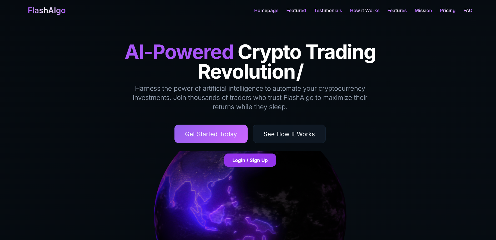
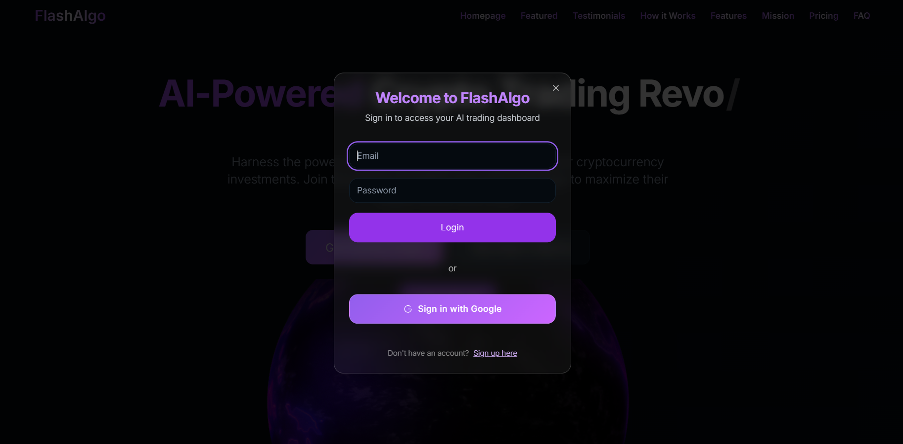

# FlashAlgo 🚀

FlashAlgo is a cutting-edge AI-powered crypto trading landing page built with modern web technologies. It showcases the vision of automating cryptocurrency investments using artificial intelligence.
🌐 Live Demo
(https://flashalgo-ai.netlify.app/)


## ✨ Features

- ⚡ Beautiful hero section with typewriter animation  
- 🧠 Glassmorphic login/sign-up modal with Google login option  
- 🌍 Embedded 3D Spline Earth animation  
- 📈 Clean UI/UX with modern component architecture  
- 🖥️ Fully responsive for desktop and mobile devices  
- 🔒 Modal supports login & signup toggle with translucent background  

## 📸 Preview

  


## 🛠️ Tech Stack

- React + TypeScript  
- Tailwind CSS  
- Framer Motion  
- React Simple Typewriter  
- Spline 3D  
- ShadCN UI components  
- Vite / Webpack (based on your setup)

## 🔧 Getting Started

```bash
git clone https://github.com/Anamitraroy22/FlashAlgo.git
cd FlashAlgo
npm install
npm run dev

🌐 Live Demo
(https://flashalgo-ai.netlify.app/)
📁 Folder Structure
css
Copy
Edit
src/
├── assets/              
├── components/          
├── pages/               
└── App.tsx              
💡 Roadmap
✅ Hero section

✅ Login/signup modal

✅ Spline Earth animation

🔜 Backend authentication (Firebase / Supabase)

🔜 User dashboard & trading insights

🔜 Live trading metrics from API

🤝 Contributing
Pull requests are welcome. For major changes, open an issue first to discuss what you would like to change.

📄 License
MIT License

Crafted with 💜 by Anamitra Roy
